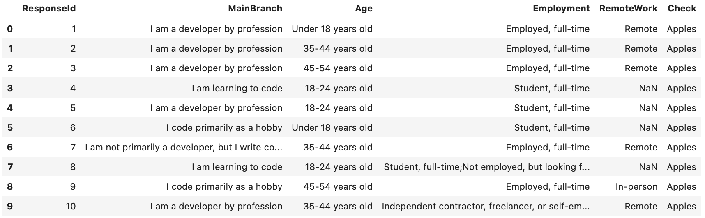
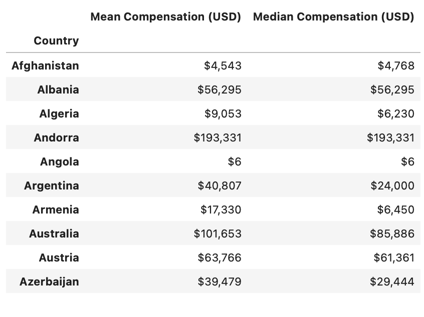
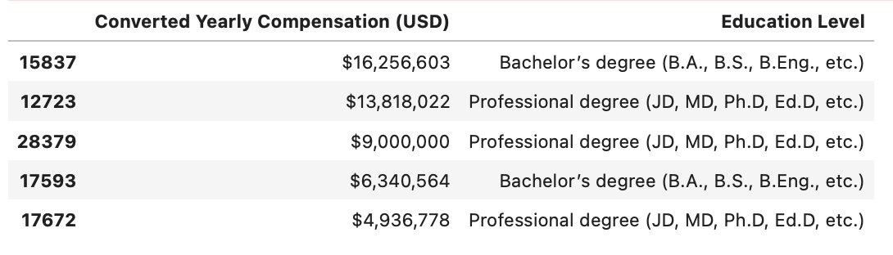
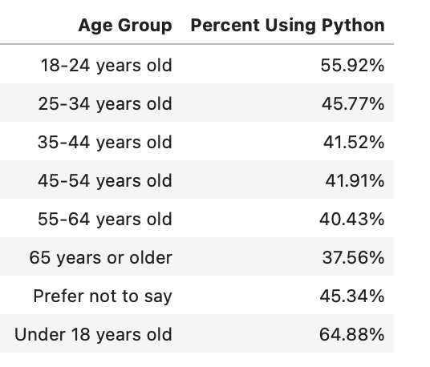
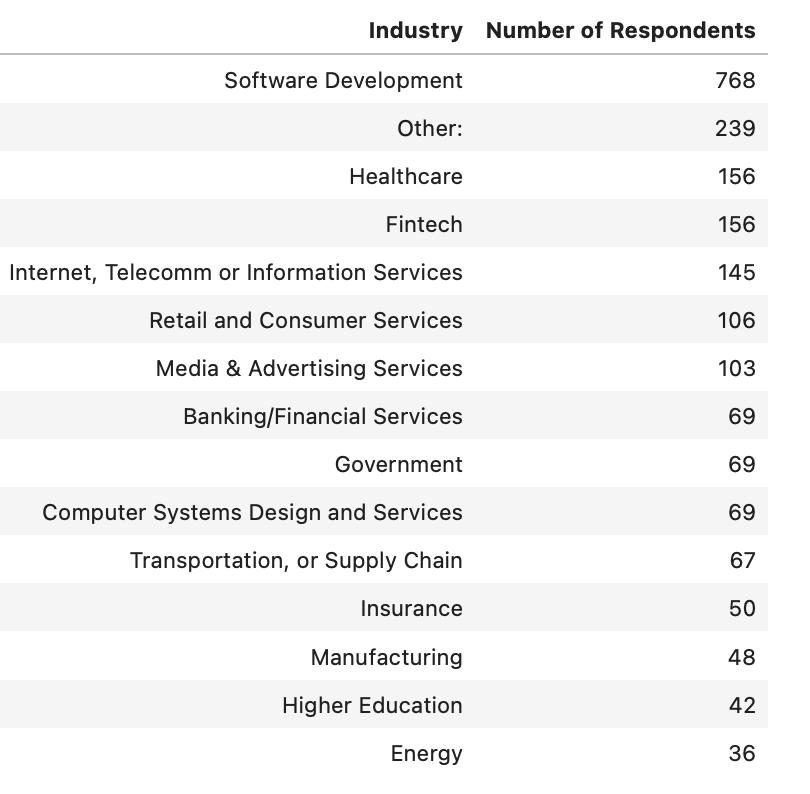

# Stack Overflow Survey Analysis

This project explores responses from the Stack Overflow Developer Survey to uncover insights about developers' experience, remote work, education, compensation, and Python usage.

---

## Data & Schema

- **Source files**:
  - `survey_results_public.csv` – Main survey data
  - `survey_results_schema.csv` – Schema file with question identifiers (`qname`)

- **Challenges**:
  - Many questions have multiple answers stored across multiple columns.
  - Valid questions were filtered using the schema file by intersecting `qname` fields with actual dataset columns.

### Sample Survey Data (Partial View)

  

---

## Python Analysis

The following questions were answered using pandas and numpy in a Jupyter Notebook:

1. How many people answered the survey?
2. How many answered all valid survey questions?
3. What are the measures of central tendency (mean, median, mode) for respondents' work experience?
4. How many respondents work remotely?
5. What percentage of respondents program in Python?
6. How many learned to program via online courses?
7. Among Python users, what are the average and median yearly compensations by country?
8. What are the education levels of the top 5 highest-paid respondents?
9. What percentage of each age group uses Python?
10. Among the top 25% earners who work remotely, which industries are most common?

---

## Code

All logic is implemented in this Jupyter notebook: 
[StackOverflow_Survey_Data_Exploration.ipynb](./StackOverflow_Survey_Data_Exploration.ipynb)

Key techniques include:
- Dataset cleaning & exploration
- Filtering based on schema definitions
- Grouping and aggregation
- Compensation percentiles
- Sorting and subsetting

---

## Results

### Python Developer Compensation by Country

  

### Education Levels of Top 5 Highest-Paid Respondents

  

### Python Usage by Age Group

  

### Top Industries Among High-Earning Remote Developers

  

---

## Summary

This project demonstrates the use of Python for real-world data cleaning and exploratory analysis. It highlights skills in set operations, filtering, grouping, and statistical interpretation applied to large survey data.
